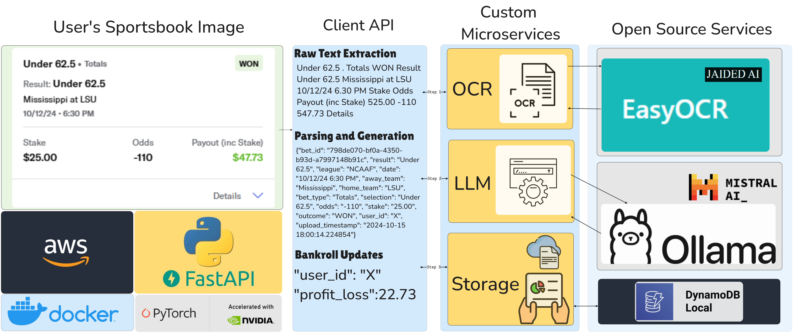
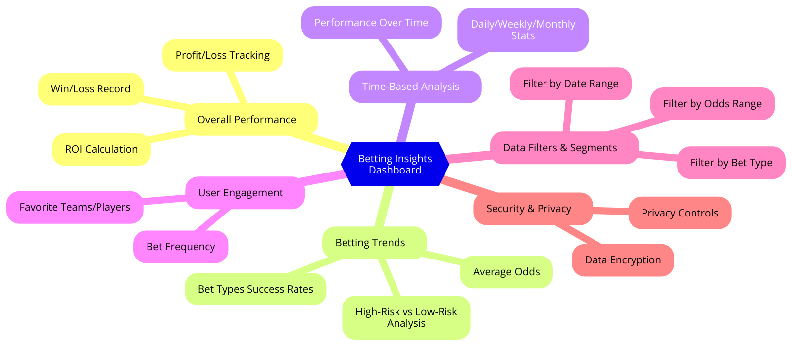
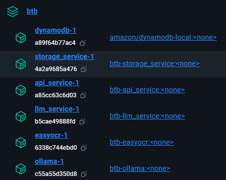
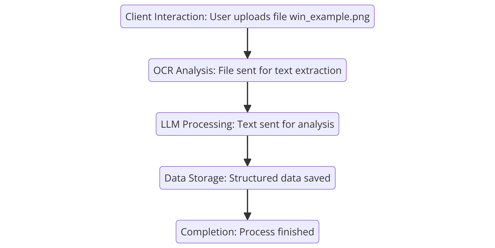
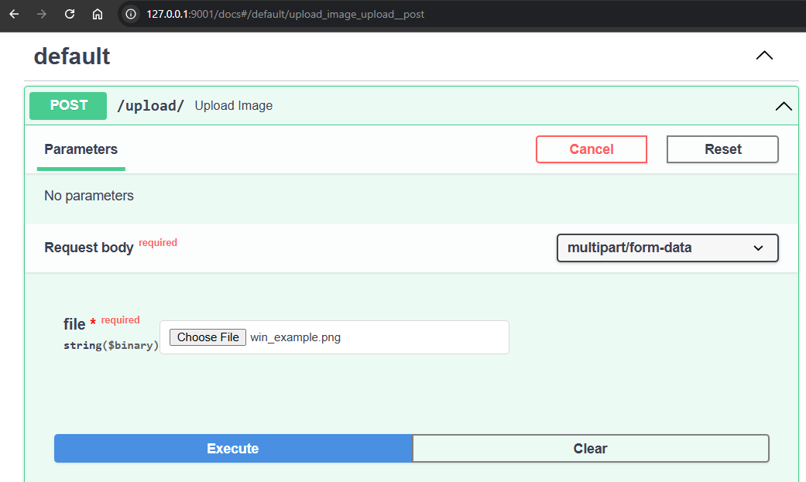
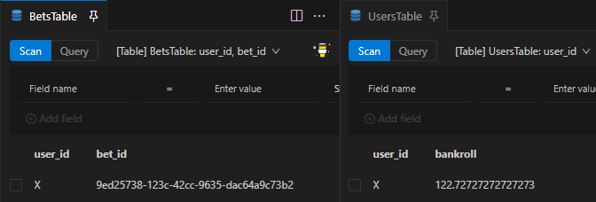
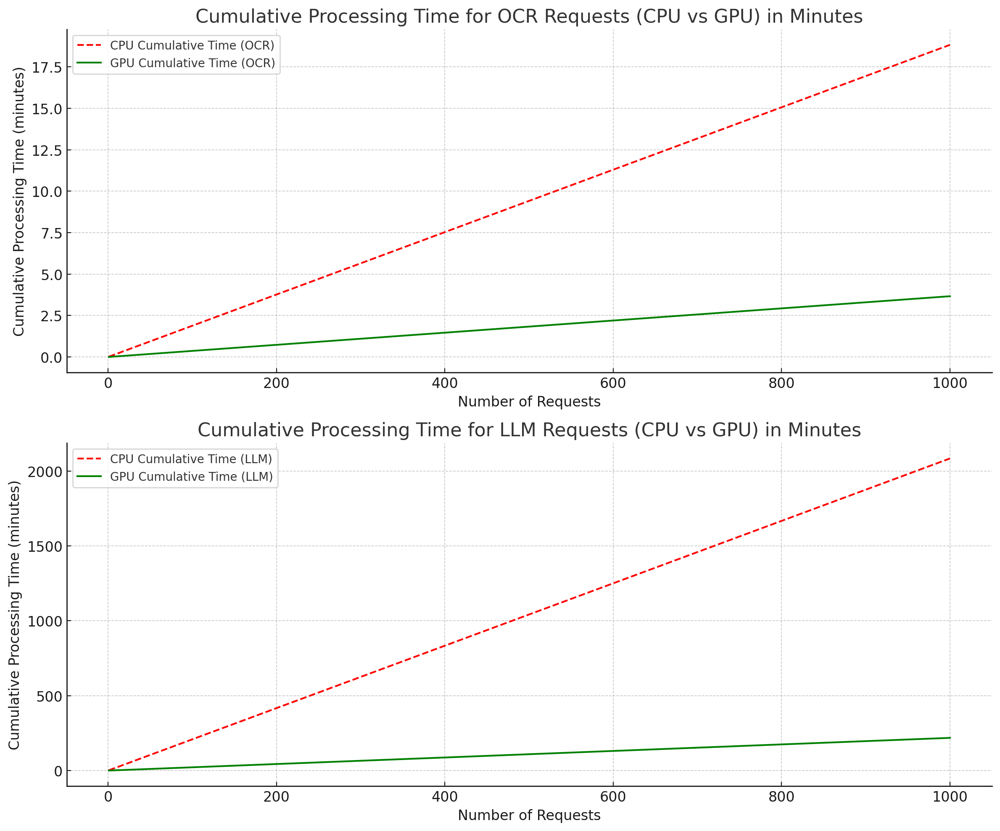

# Beat the Books! (b.t.b)



## Project Overview

This project aims to analyze betting data using AI-driven microservices, providing insights that enhance decision-making and improve betting strategies. The flow diagram below shows how data moves between these services, including the API, OCR, LLM, and Storage services.

This project has several microservices, each designed to handle a specific task in the system. All services are packaged using Docker and managed with `docker-compose` for easy setup. Docker ensures consistent environments, simplifying deployment across systems. `docker-compose` makes it easier to manage multiple containers, allowing the services to work together smoothly. This README provides an overview of the system setup, development process, and contribution guidelines for developers and AI enthusiasts interested in improving the project.

### Why?
Providing insights across a variety of sportsbooks can be difficult. Sportsbook developers are incentivized to reduce visibility into bettors performance metrics. A tool like this can be used to capture bets and view analysis across a variety of dimensions.

The key next step would be to develop an insights dashboard based on the data source provided by the ingestion framework in this application.



**Example Summary:**

```json
{
    "total_profit_loss": -68.46320346320347,
    "league_breakdown": {
      "NFL": -90,
      "NCAAF": 21.5368
    },
    "bet_type_breakdown": {
      "Totals": -92.2727,
      "Spread": 23.8095
    }
  }
```

## Flow Description:

1. **Client Interaction**: A user uploads a file.
2. **OCR Analysis**: When a user uploads an image or document, it goes to the EasyOCR Service, which processes the file and extracts important betting information.
3. **LLM Processing**: Any text that needs more analysis, like understanding natural language or bet details, is handled by the LLM Service. This service uses Ollama's hosting of Mistral AI's mistral7b model.
4. **Data Storage**: The processed data is then sent to the Storage Service, which uses DynamoDB to store the data. This helps track, visualize, and analyze betting information over time.

## Open Source Tools

1. **EasyOCR Python Package**: [GitHub Repository](https://github.com/JaidedAI/EasyOCR) | [PyPI](https://pypi.org/project/easyocr/)
2. **Ollama**: [Website](https://ollama.com/) | [PyPI](https://pypi.org/project/ollama/)
3. **AWS DynamoDB Local**: [Docker Hub](https://hub.docker.com/r/amazon/dynamodb-local)

## Getting Started

To get started, you can quickly start all the services using Docker Compose from the root directory:

```sh
docker compose up --build
```

### Steps to Run the Project

1. **Clone the Repository**:

   ```sh
   git clone https://github.com/nate-sepich/b.t.b.git
   ```

2. **Set Up Your Environment**:

   - The default model for this project is `mistral` and will be pulled the first time the `llm_service` Docker container is created.
   - For additional Ollama container controls for LLM hosting, see [this README](llm_service/self-hosting/ollama/README.md) for details.
   - **IMPORTANT**: This can be configured with the `BTB_OLLAMA_MODEL` environment variable in [Docker Compose](docker-compose.yml#25).

3. **Build and Start All Services Using Docker Compose**:

   ```sh
   cd b.t.b
   docker compose up --build
   ```

4. **Verify That All Services Are Up and Running**:

   - Make sure that all the service containers (API, EasyOCR, LLM, Storage, and DynamoDB) are running and healthy.

   ```sh
   docker ps
   ```

    - Docker Desktop View: 

5. **Access the API Service**:

   - By default, the API Service will be available at [http://localhost:9001](http://localhost:9001/docs).
   - You can use FastAPI's Swagger UI to test the endpoints directly. The Swagger UI is available at [http://localhost:9001/docs](http://localhost:9001/docs). For more information, refer to the [FastAPI documentation](https://fastapi.tiangolo.com/).

## System Flow

1. **Client Interaction**: Client requests are handled by the API Service (`api/app.py`), which directs the requests to the appropriate backend services, such as the EasyOCR service for text extraction, the LLM service for language processing and content creation, and the Storage service for saving data.
2. **OCR Requests**: If a client request involves text extraction, the API Service sends it to the EasyOCR service (`easyocr/app.py`). The extracted text is processed and returned.
3. **LLM Interaction**: For requests involving language model processing or content generation, the LLM Service (`llm_service/app.py`) is used. The Gemini client manages communication with Google's language model.
4. **Data Storage**: Persistent data is handled through the Storage Service (`storage/app.py`), which uses a local DynamoDB instance.

## Service Overview


### 1. API Service

The **API Service** is the main entry point for clients and manages routing requests between the different microservices.

- **app.py**: A FastAPI application that manages incoming client requests and coordinates with services like Storage, LLM, and EasyOCR.
- **Dockerfile**: Builds the container image for running the API Service, ensuring all necessary dependencies are included.

### 2. EasyOCR Service

The **EasyOCR Service** provides Optical Character Recognition (OCR) capabilities to extract text from images. It supports common image formats like JPEG, PNG, and PDF, and can be used for screenshots of sports betting information.

- **app.py**: A FastAPI-based wrapper around the EasyOCR library, providing an endpoint to process images.
- **Dockerfile**: Configures the container to use GPU support for faster OCR processing.

### 3. LLM Service

The **LLM Service** handles interactions with Google's Gemini language model to process natural language and generate content.

- **app.py**: A FastAPI application that provides endpoints for LLM requests.
- **ollama\_client.py**: Manages interaction with the Ollama LLM, including prompt creation, configuration, and the content generation process.
- **Dockerfile**: Builds the container for running the LLM Service, including the necessary dependencies to access Google's compute resources.

### 4. Storage Service

The **Storage Service** handles data storage, using a local DynamoDB environment.

- **app.py**: Provides FastAPI endpoints for creating, reading, updating, and deleting data in DynamoDB.
- **btb.py**: Contains integration functions to facilitate working with DynamoDB.
- **Dockerfile**: Defines the container image for running the Storage Service, including required dependencies.

### 5. Service Models

- **models.py**: Defines data models used across the services to ensure data is validated and structured consistently throughout the system.

### 6. Docker Compose

- **docker-compose.yml**: Sets up the overall service configuration, including network settings, service dependencies, and shared volumes. This allows for unified deployment and easy integration of all services.


### Flow Example

<p align="center">
    
</p>

1. **Client Interaction**:

   - A user uploads a file named `win_example.png`.

   ```plaintext
   api_service-1 | INFO - Received file: win_example.png
   ```
<p align="center">
    
</p>

2. **OCR Analysis**:

   - The file is sent to the OCR service for text extraction.

   ```plaintext
   api_service-1 | INFO - Sending file to OCR service
   easyocr-1 | INFO - File win_example.png read successfully.
   easyocr-1 | INFO - File win_example.png successfully converted to numpy array.
   easyocr-1 | INFO - Text extraction completed for file win_example.png.
   easyocr-1 | INFO - Extracted text: Under 62.5 . Totals WON Result Under 62.5 Mississippi at LSU 10/12/24 6.30 PM Stake Odds Payout (inc Stake) 525.00 -110 547.73 Details
   ```

   - Extracted text: `Under 62.5 . Totals WON Result Under 62.5 Mississippi at LSU 10/12/24 6.30 PM Stake Odds Payout (inc Stake) 525.00 -110 547.73 Details`

3. **LLM Processing**:

   - The extracted text is sent to the LLM service for further analysis, using specific prompting techniques and Python integrations with the Ollama service to generate structured JSON with expected fields.

   ```plaintext
   api_service-1 | INFO - Sending request to LLM service
   llm_service-1 | INFO - Generating content from model
   llm_service-1 | INFO - Parsed data: [{'bet_id': None, 'result': 'Under 62.5', 'league': 'NCAAF', 'date': '10/12/24 6:30 PM', 'away_team': 'Mississippi', 'home_team': 'LSU', 'wager_team': None, 'bet_type': 'Totals', 'selection': 'Under 62.5', 'odds': '-110', 'stake': '25.00', 'payout': '47.73', 'outcome': 'WON'}]
   ```

4. **Data Storage**:

   - The structured data is sent to the Storage service.

   ```plaintext
   api_service-1 | INFO - Sending parsed data to Storage service
   storage_service-1 | INFO - Calculated profit/loss for bet 9ed25738-123f-42cc-9635-dac64a9c73b2: 22.73
   ```
<p align="center">
    
</p>

5. **Completion**:

   - The entire process completes in approximately 14 seconds.

   ```plaintext
   api_service-1 | - root - INFO - Processing complete in: 13.989617347717285 seconds
   ```


## GPU vs CPU Processing

### Time Differences

- **OCR Analysis**:

  - **CPU**: 1.13 seconds
  - **GPU**: 0.22 seconds

- **LLM Processing**:

  - **CPU**: 2 minutes 5 seconds
  - **GPU**: 13.1 seconds

- **Total Processing Time**:

  - **CPU**: 127 seconds
  - **GPU**: 13.39 seconds

### Advantages of GPU Acceleration

- **Speed**: The GPU significantly reduces the processing time for both OCR and LLM tasks. In some cases, the GPU is able to provide an order of magnitude reduction in processing times. For example, the LLM processing time on the CPU takes over 2 minutes, whereas on the GPU it takes just over 13 seconds. This is an almost tenfold reduction, which highlights the powerful benefits of GPU acceleration for time-sensitive operations.
- **Efficiency**: Faster processing allows for more tasks to be handled in a shorter time frame. The drastic difference in processing times means that the system can manage more user requests concurrently, without the need to significantly scale up CPU resources.


### Scaling Example

GPUs, and eventually quantum computers, fundamentally change computing. GPUs excel at parallel processing, which is especially beneficial for deep learning models that require simultaneous computation across multiple data points. This aspect is often misunderstood. To illustrate the impact, consider the following:

If the system needs to process 1,000 user requests per day, and each request involves OCR and LLM processing:

- **CPU Only**: With an average total processing time of 127 seconds per request, it would take approximately 35.3 hours to handle 1,000 requests. This means the system would not be able to keep up, as there are only 24 hours in a day.
- **GPU Accelerated**: With GPU acceleration reducing the total processing time to 13.39 seconds per request, it would take only about 3.7 hours to process the same 1,000 requests. This allows for significant scaling and the ability to handle even higher user loads without compromising on performance.

#### Visualization

- OCR: 5.1x Faster
- LLM: 9.5x Faster

