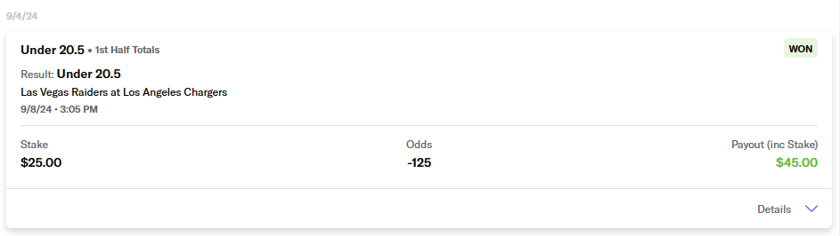

# Project Name

&#x20;

# Getting Started

To get started, you can quickly spin up all the services using Docker Compose from the root directory:

`docker compose up --build` 
## Steps to Run the Project

1. **Clone the Repository**:
    ```sh
    git clone <repository-url>
    cd <repository-directory>
    ```

2. **Set Up Your Environment**:
    - Create a `.env` file in the root directory with the necessary environment variables, such as Google Cloud credentials and API keys.
    - EX: GOOGLE_API_KEY=1234_AbCd

3. **Build and Start All Services Using Docker Compose**:
    ```sh
    docker compose up --build
    ```

4. **Verify That All Services Are Up and Running**:
    - Ensure that the containers for all services (API, EasyOCR, LLM, Storage, and DynamoDB) are listed and healthy.
    ```sh
    docker ps
    ```

5. **Access the API Service**:
    - By default, the API Service will be available at [http://localhost:9001](http://localhost:9001/docs).
    - You can use FastAPI's Swagger UI to test the endpoints directly. The Swagger UI is available at [http://localhost:9001/docs](http://localhost:9001/docs). For more information, refer to the [FastAPI documentation](https://fastapi.tiangolo.com/).


# Project Overview

This project consists of multiple microservices, each tailored to fulfill a specific function within the overall system. All services are containerized using Docker, and managed with `docker-compose` for straightforward orchestration. Docker was chosen for its ability to provide consistent environments, making it easier to deploy microservices reliably across different systems. `docker-compose` simplifies managing multiple containers, enabling seamless orchestration and network configuration for all services. This README provides an overview of the system architecture, development setup, and how to contribute.

# System Flow

1. **Client Interaction**: Client requests are handled by the API Service (`api/app.py`), which routes the requests to the appropriate backend services, such as the EasyOCR service for text extraction, the LLM service for natural language processing and content generation, and the Storage service for data persistence.
2. **OCR Requests**: If a client request requires text extraction, the API Service forwards it to the EasyOCR service (`easyocr/app.py`). The extracted text is processed and returned.
3. **LLM Interaction**: For requests involving language model processing or content generation, the LLM Service (`llm_service/app.py`) is used. The Gemini client manages communication with Google's language model.
4. **Data Storage**: Persistent data is handled through the Storage Service (`storage/app.py`), which interacts with a local DynamoDB instance.

# Service Overview

## 1. API Service

The **API Service** serves as the entry point for clients and acts as the main orchestrator for routing requests among the different microservices.

- **app.py**: A FastAPI application that manages incoming client requests and coordinates between services like Storage, LLM, and EasyOCR.
- **Dockerfile**: Builds the container image for running the API Service, ensuring all necessary dependencies are included.

## 2. EasyOCR Service

The **EasyOCR Service** is responsible for providing OCR capabilities, enabling extraction of text from images. It supports common image formats such as JPEG, PNG, and PDF, and can be used for various sports books screenshots.
### Example Input for OCR


- **app.py**: A FastAPI-based wrapper around the EasyOCR library, providing an endpoint to process images.
- **Dockerfile**: Configures the container for GPU support to enhance the OCR processing speed.

## 3. LLM Service

The **LLM Service** handles interactions with Google's Gemini language model to fulfill content generation or NLP-related requests.

- **app.py**: A FastAPI application that serves endpoints for LLM requests.

- **gemini\_client.py**: Handles the interaction with the Gemini LLM, managing prompt creation, configuration, and the content generation pipeline.

- **Dockerfile**: Builds the container for running the LLM Service, including dependencies for accessing Google's compute resources.

## 4. Storage Service

The **Storage Service** manages persistent data, leveraging a local DynamoDB environment.

- **app.py**: Provides FastAPI endpoints for CRUD operations against DynamoDB.
- **btb.py**: Contains integration functions to simplify DynamoDB interactions.
- **Dockerfile**: Defines the container image for running the Storage Service, including required dependencies.

## 5. Service Models

- **models.py**: Provides data models used across various services to ensure consistent data validation and standardized structures throughout the system.

## 6. Docker Compose

- **docker-compose.yml**: Defines the overall service orchestration, including network settings, service dependencies, and shared volumes. This allows for unified deployment and integration of all services.